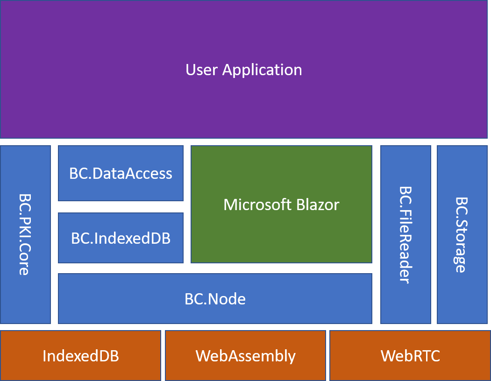

# Architecture
The unblocked platform was designed from the ground up to allow application developers to write applications with the following key attributes:

* **Run Anywhere** - Applications developed with unblocked run on any [modern web browser](https://html5readiness.com/).
* **Include Full functionality data access** - Applications developed with the unblocked provide full featured data models and access
* **Require no backend** - Unblocked applications only require a flat file web server such as [github pages](https://pages.github.com/). There is no requirement for central databases or servers.
* **Are very secure** - Unblocked applications use a comprehensive [X509 Certificate](https://en.wikipedia.org/wiki/X.509) infrastructure and industry grade encryption and decryption.
* **Are highly scalable** - Processing occurs on users devices and data is shared peer-to-peer meaning these applications are highly scalable.
* **Are simple to write** - Unblocked applications are easy and quick to write
* **Uses your current knowledge** - Developers with an understanding of [HTML](https://en.wikipedia.org/wiki/HTML), [CSS](https://en.wikipedia.org/wiki/Cascading_Style_Sheets) and [C#](https://en.wikipedia.org/wiki/C_Sharp_(programming_language)) can easily write unblocked applications.

We've been developing this platform since the advent of the [Blazor](https://blazor.net) project to provide a way to solve some of our challenging technology issues. In January 2019, we decided to release our system as a platform that others can use to develop their own distributed applications.

At the core of unblocked is a **[distributed ledger](https://www.investopedia.com/terms/d/distributed-ledgers.asp)**, using a technology that we developed purely in .net. Our distributed ledger implements end to end [cryptography](https://en.wikipedia.org/wiki/Cryptography), [merkle trees](https://en.wikipedia.org/wiki/Merkle_tree) for speed, epochs for data storage and [X509 Certificates](https://en.wikipedia.org/wiki/X.509) for Private and Public key storage.

*Architecture Diagram*

The diagram above shows a high level overview of the complete architecture of an application written on the platform. The various components are described below:

## User Generated

### User Application
Users (or developers) using the platform develop their applications in [Visual Studio](https://visualstudio.microsoft.com/). The development experience is similar to developing a [Razor](https://docs.microsoft.com/en-us/aspnet/web-pages/overview/getting-started/introducing-razor-syntax-c) application or more closely aligned a [Microsoft Blazor Client Side application](https://dotnet.microsoft.com/apps/aspnet/web-apps/client).

As there is no need for servers in this platform implementation, we do not have a concept of a server hosted example.

  ***Note**: It may be possible in the future to leverage functionality in the dotnet core server functions but for version 1 of the platform, this is not considered.*

## Microsoft Provided
### [Microsoft Blazor](https://dotnet.microsoft.com/apps/aspnet/web-apps/client)
Microsoft's Blazor framework is a new [Single Page Application Framework](https://en.wikipedia.org/wiki/Single-page_application), written in .Net which takes advantage of [WebAssembly](https://webassembly.org/). As our platform requires WebAssembly, the Blazor framework makes sense to use.

## 3rd Party
### IndexedDB
IndexedDB is a No-SQL database included in every modern browser which supports html5. It provides a high performance local database.

### WebAssembly
WebAssembly is a new technology which allows the compilation of code into a new assembly language which operates at high speed inside a browser virtual machine.

### WebRTC
WebRTC is a peer to peer communication system within the browser. Initially designed to support voice and video, WebRTC allows the transmission of data across and through complex networks.

## Unblocked Components
### BC.DataAccess
The BC.DataAccess Layer provides a public API to support data operations. Using the BC.DataAccess Layer, one can define and manage data models and send and receive data between users of teh application using a simple, accessible programming style.

### BC.IndexedDB
The BC.IndexedDB Library provides access for our software to use IndexedDB from Blazor. It provides a number of advanced housekeeping functions to ensure the consistency and performance of IndexedDB whether on a phone, PC or Server.

### BC.Node
The BC.Node component manages the distributed ledger. It is responsible for sending data between nodes, managing the chain of secure data blocks, voting on founders and operating the peer to peer network.

### BC.PKI.Core
The PKI.Core library provides functions for managing X509 Certificates, for the encryption and decryption of data and for the signing and verification of data.

### BC.FileReader
The BC.FileReader component provides access to the local filesystem of the user from Blazor.

### BC.Storage
The BC.Storage library provides functions for accessing browser LocalStorage and SessionStorage.

# External Functions
Whilst the platform does not require any infrastructure from its developers and users, we use a few central services to keep everything running smoothly.

## Payment Portal
The Payment portal is responsible for generating signed X509 Certificates for applications an users.

## STUN and TURN Server
The STUN and TURN servers help the nodes negotiate how to communicate through complex NAT environments.

## Azure Functions
We have a couple of serverless functions which allow new nodes to find the registered nodes in a network and also a store of the secure ledger for each application.

|  |  |  | 
| - | - | - |
| |   |  | |
|   |  |  |

